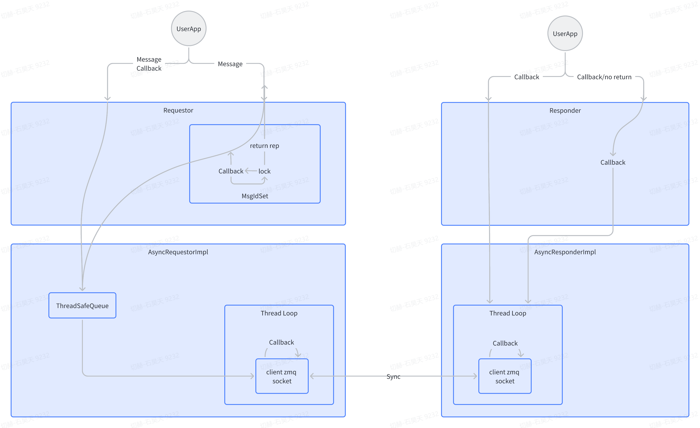

# ezcom

## 概述

- ezcom是一个轻量化、API易用的C++通信库
- ez = easy + ZMQ

ezcom依赖：
  - protobuf v.3.20.1-rc1
  - libzmq v4.3.5

ezcom使用protobuf进行序列化，底层封装了ZMQ进行通信，并原生支持ZMQ的ipc和tcp通信模式
- 支持跨域、跨设备tcp网络通信
- 节点可任意时间进入连接，client，server没有启动顺序要求。server晚启动不会丢失消息
- 支持三种通信模式
  - 同步消息请求-消息回复
  - 同步数据请求-无需回复
  - 异步消息请求-消息回复
- 支持基本数据类型的自动序列化
  - double，float，int32，int64，uint32，uint64，bool，string
- 支持用户自定义数据结构的强制序列化，利用reinterpret_cast强制转换。需要两端字节对齐

## 详细设计
- AsyncRequestorImpl和AsyncResponderImpl是两个核心类，这两个类中分别启动一个线程，封装ZMQ的REQ-REP模式的同步通信模型，改造成异步通信。
  - AsyncResponderImpl中的线程较为简单，在线程启动时传入一个消息处理的回调函数，并在线程中while循环处理收到来自client端的消息，并使用处理函数的返回值作为消息返回
  - AsyncRequestorImpl中维护一个线程安全队列，队列中将同时保存一个Message和它对应的Callback作为队列的一个Item。AsyncRequestorImpl中的线程启动后，循环等待读取线程安全队列，一旦队列中被放入一条消息（及它的Callback），此线程就取出这条消息，并将它发送出去，等待server的回复消息。收到回复后再调用这条消息对应的Callback函数
- Requestor和Responder则是在两个异步通信类上，对异步通信流程封装同步、异步接口以及超时机制。用以适配用户的不同通信场景

- 